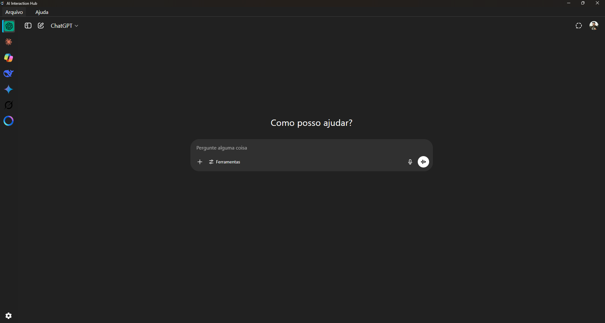
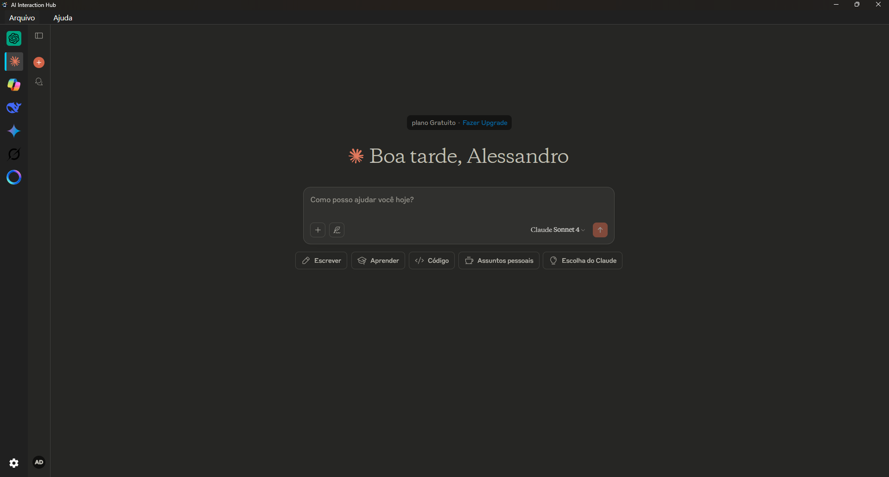

  

# AI Interaction Hub 
Projeto que fiz para ser um hub de IA, as que eu mais utilizo em um lugar só. Tomei como base o Ferdium para criar essa aplicação

É necessário para começar emular a aplicação na máquina local, deve executar esse comando para instalar o electron e suas dependências: npm install electron --save-dev

Para iniciar a aplicação para teste: npm start

Para gerar um executável com o instalador: npm install --save-dev electron-builder e depois utilize o npm run dist para gerar a distribuição

Chat GPT

Claude

🔄 Futuras Melhorias
- Suporte a múltiplas janelas (caso queira cada IA em uma janela separada).
- Exportar logs de conversas ou sessões com as IAs.
- Adicionar abas dinâmicas com ícones customizados via drag-and-drop.
